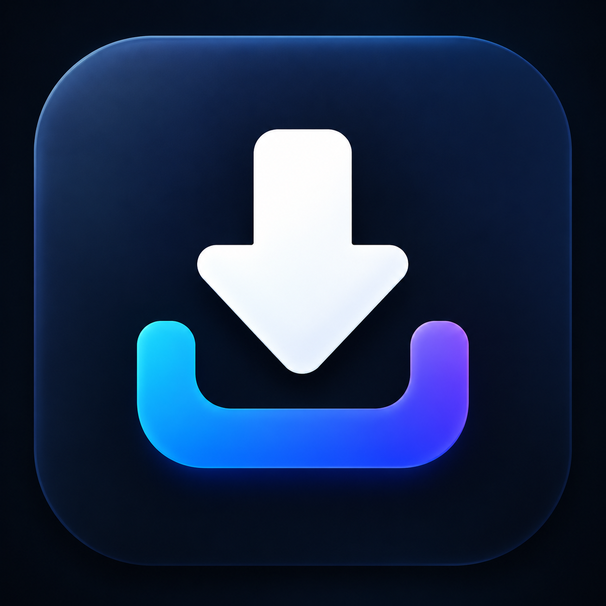
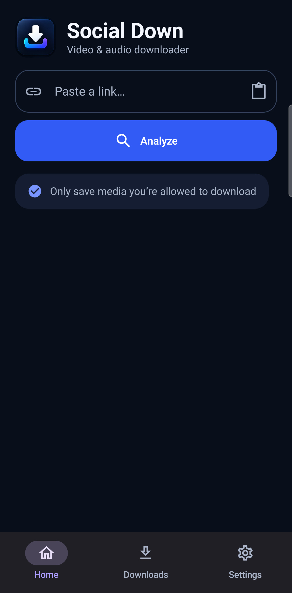
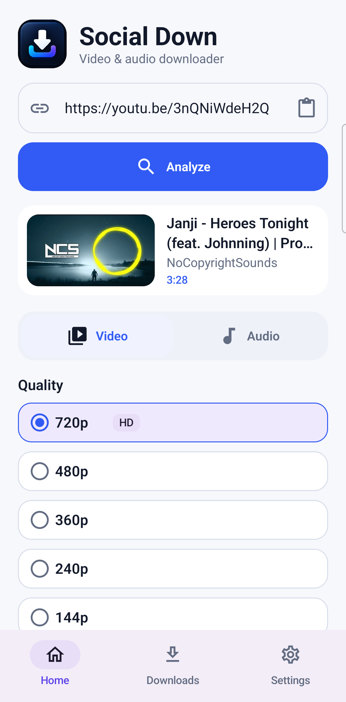
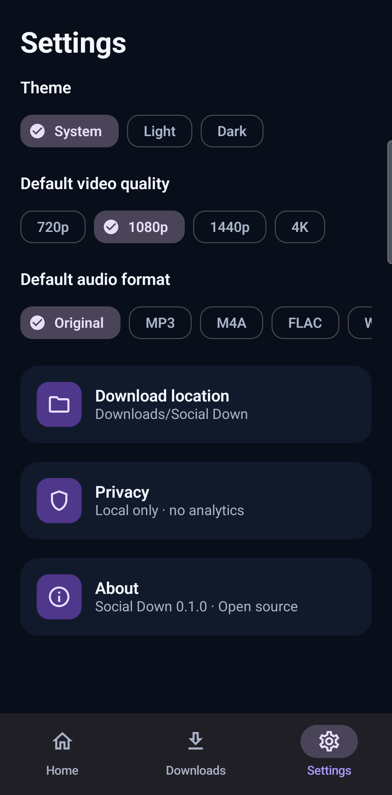
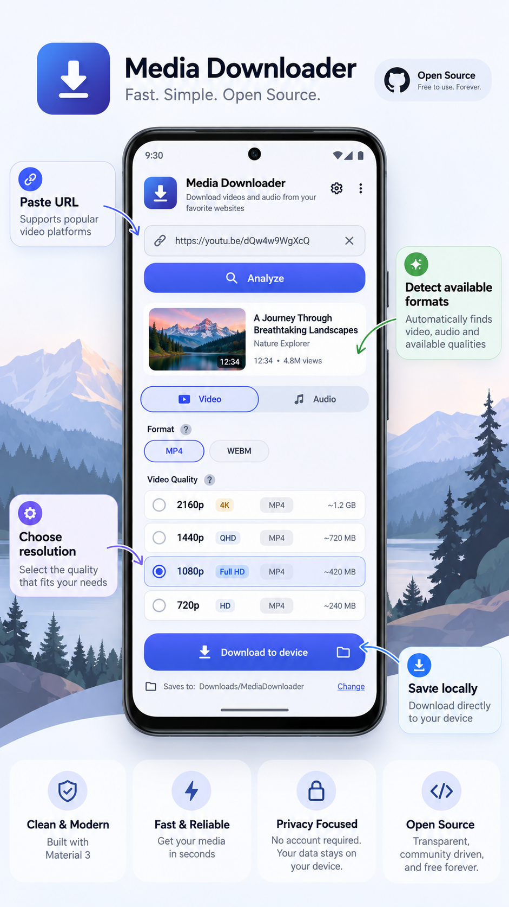

# Social Down

Social Down is a minimal, local-first Android media downloader built with Kotlin and Jetpack Compose. Paste a supported, non-DRM media URL, inspect the formats the source actually provides, choose video or audio output, and save it to `Downloads/Social Down`.

## Download

[](https://github.com/UnrealUjelo/social-down/releases/download/v0.1.0/Social-Down-v0.1.0-debug.apk)

**[Tap here to download the APK directly](https://github.com/UnrealUjelo/social-down/releases/download/v0.1.0/Social-Down-v0.1.0-debug.apk)** · Android 10+ · 260 MB

This testing release is signed with the Android debug key. Android may ask you to allow installs from your browser before installation.

> Only download media that you own or are authorized to save. Social Down does not bypass DRM, paywalls, authentication, or access controls, and downloading may be restricted by a website's terms or applicable law.



## Screenshots

<table>
  <tr>
    <td align="center"><strong>Home · Dark</strong></td>
    <td align="center"><strong>Media analysis · Light</strong></td>
    <td align="center"><strong>Settings · Dark</strong></td>
  </tr>
  <tr>
    <td></td>
    <td></td>
    <td></td>
  </tr>
</table>

## Design concept

The app follows the supplied concept's compact cards, strong blue actions, clear quality rows, and low text density. The production UI includes matching light and dark color systems.



## Features

- URL analysis through yt-dlp, without a hard-coded site allowlist
- Available video resolutions, deduplicated and ordered
- Adaptive video + audio merging through bundled FFmpeg
- Original audio preservation or MP3, M4A, FLAC, and WAV output
- Background downloads with progress notifications and cancellation
- Throttled in-app yt-dlp updates with an offline fallback to the bundled version
- MediaStore output in `Downloads/Social Down`
- Room-backed download history
- Android Share Sheet input
- System, light, and dark themes
- No account, analytics, tracking, or remote database
- Filename, path, metadata, and process-argument hardening

## Requirements

- Android Studio with JDK 17
- Android SDK Platform 37 and Build Tools 36.0.0
- Android 10 (API 29) or newer device/emulator

## Build

```bash
./gradlew assembleDebug
```

On Windows:

```powershell
.\gradlew.bat assembleDebug
```

Run the local test and verification suite:

```bash
./gradlew testDebugUnitTest lintDebug assembleDebug
```

The debug APK is generated at `app/build/outputs/apk/debug/app-debug.apk`.

## Architecture

The first release intentionally uses one Gradle app module while maintaining replaceable package boundaries:

```text
com.socialdown.app/
├── core/
│   ├── common/       validation, normalization, filename safety
│   ├── database/     Room history
│   ├── downloader/   WorkManager, yt-dlp, MediaStore
│   ├── extractor/    MediaExtractor and yt-dlp adapter
│   ├── model/        normalized domain models
│   └── preferences/  DataStore settings
├── feature/
│   ├── home/
│   ├── downloads/
│   └── settings/
└── ui/theme/
```

Compose only consumes normalized domain/UI state. It does not call yt-dlp, FFmpeg, Room, WorkManager, or MediaStore directly. Hilt wires interfaces to their implementations; this keeps extraction and transfer engines replaceable.

Downloads run as foreground `CoroutineWorker`s. yt-dlp selects or combines compatible streams, its bundled FFmpeg performs remuxing/conversion, and the finished file is copied from a private, validated work directory into MediaStore. Temporary files are then removed.

## Privacy and permissions

Social Down processes URLs on the device. Network traffic is limited to extractor and media requests initiated by the user. There are no analytics, trackers, accounts, advertising SDKs, or Social Down servers.

The app requests:

- `INTERNET` to analyze and retrieve requested media
- notification/foreground-service permissions for visible background downloads

Scoped storage and MediaStore are used; broad storage access is not requested.

## Non-DRM scope

Social Down supports only media that yt-dlp can access without defeating technical protection. The project will not accept code for DRM circumvention, Widevine bypass, credential theft, paywall bypass, or access-control bypass. See [SECURITY.md](SECURITY.md).

## Key dependencies

- AndroidX Compose Material 3, Lifecycle, Room, WorkManager, and DataStore
- Dagger Hilt
- Coil
- `youtubedl-android` (yt-dlp plus FFmpeg Android integration)

Dependency versions are centralized in `gradle/libs.versions.toml`. Third-party components retain their own licenses. In particular, `youtubedl-android` is GPL-3.0, so Social Down is distributed under GPL-3.0 as well.

## Contributing

Issues and pull requests are welcome. Read [CONTRIBUTING.md](CONTRIBUTING.md) and the [Code of Conduct](CODE_OF_CONDUCT.md) before contributing. Security reports should follow [SECURITY.md](SECURITY.md), not public issue threads.

## License

Copyright © 2026 Social Down contributors. Licensed under the [GNU General Public License v3.0](LICENSE).
